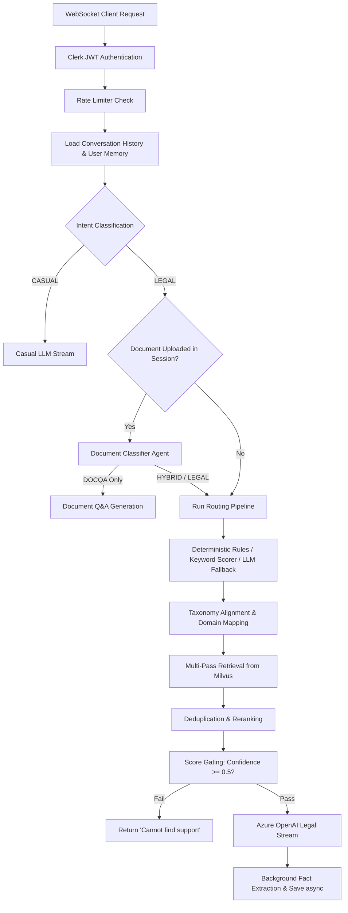

# Digirett Core Backend Service

FastAPI service that manages multi-agent routing, legal search retrieval, conversation persistence, and secure token streaming for the Digirett platform.

**Deployed Application:** [https://digirett-ai-agent-chi.vercel.app/](https://digirett-ai-agent-chi.vercel.app/)

---

## Codebase Directory Structure

Detailed directory mapping of the backend repository:

### Core Folders & Modules

*   **[api/](api/)**: Core REST and WebSocket routes.
    *   **[routes/](api/routes/)**: Specific routes:
        *   [admin.py](api/routes/admin.py): Admin views and platform health.
        *   [auth.py](api/routes/auth.py): Clerk role verification and profile sync.
        *   [cal.py](api/routes/cal.py) / [cal_webhooks.py](api/routes/cal_webhooks.py): Cal.com integration.
        *   [chat.py](api/routes/chat.py): WebSocket endpoint (`ws://host/api/v1/chat/ws`) for token streaming, rate limiting, and background fact updates.
        *   [conversations.py](api/routes/conversations.py): Chat session storage.
        *   [documents.py](api/routes/documents.py): Manages manual context document uploads and attachments.
        *   [health.py](api/routes/health.py): Health check evaluating backend, Redis, Supabase, and Milvus connectivity.
        *   [hitl.py](api/routes/hitl.py): Human-in-the-Loop ticket lifecycle endpoints.
        *   [invite.py](api/routes/invite.py): Organization invitations.
        *   [library.py](api/routes/library.py): Saved statute library.
        *   [messages.py](api/routes/messages.py): Retrieves chat messages.
        *   [notes.py](api/routes/notes.py): Personal workspace notes.
        *   [ratings.py](api/routes/ratings.py): Handles assistant response feedback ratings.
        *   [ticket_messages.py](api/routes/ticket_messages.py): Escalated ticket communication threads.
        *   [webhooks.py](api/routes/webhooks.py): Receives incoming Clerk events.

*   **[agents/](agents/)**: LLM-based entities running discrete tasks:
    *   [document_classifier_agent.py](agents/document_classifier_agent.py): Route-controller evaluating queries against uploaded contracts (DOCQA vs HYBRID vs standard RAG).
    *   [document_qa_agent.py](agents/document_qa_agent.py): Scope-locked document question answering.
    *   [generator_agent.py](agents/generator_agent.py): Final answer formulation using context.
    *   [intent_agent.py](agents/intent_agent.py): Classifies queries (`LEGAL` vs `CASUAL`) and user language.
    *   [memory_agent.py](agents/memory_agent.py): Summarizes thread context and constructs context windows.
    *   [orchestrator_agent.py](agents/orchestrator_agent.py): High-level wrapper for Intent, Language, and Memory fetching.
    *   [query_reasoning_agent.py](agents/query_reasoning_agent.py): Translates user inputs into formal Norwegian legal keywords.
    *   [reranker_agent.py](agents/reranker_agent.py): Scores and sorts retrieved vectors to maximize context relevance.
    *   [retriever_agent.py](agents/retriever_agent.py): Vector database (Milvus) querying.
    *   [router_agent.py](agents/router_agent.py): Fallback LLM router mapping queries to specific legal subdomains.
    *   [statute_registry.py](agents/statute_registry.py): Hardcoded lookup map matching popular law names to IDs.
    *   [user_memory_agent.py](agents/user_memory_agent.py): Cross-conversation fact extractor.

*   **[router/](router/)**: Subdomain routing mechanics:
    *   [deterministic_rules.py](router/deterministic_rules.py): Regex matching bypassing LLM.
    *   [keyword_scorer.py](router/keyword_scorer.py): Concept string matching.
    *   [confuser_resolver.py](router/confuser_resolver.py): Disambiguates overlapping legal domains.
    *   [alias_resolver.py](router/alias_resolver.py) / [thin_pointer_resolver.py](router/thin_pointer_resolver.py): Map acronyms/aliases to canonical database codes.
    *   [co_retrieval_resolver.py](router/co_retrieval_resolver.py): Retrieves co-dependent concepts.
    *   [result_merger.py](router/result_merger.py): Deduplicates multiple database search runs.
    *   [taxonomy_loader.py](router/taxonomy_loader.py): Parses and verifies taxonomy configurations.

*   **[services/](services/)**: Internal business services:
    *   [rag_service.py](services/rag_service.py): Core workflow service managing the RAG pipeline.
    *   [document_service.py](services/document_service.py): PDF parsing and extraction.
    *   [llm_service.py](services/llm_service.py): Azure OpenAI wrapper.
    *   [embedding_service.py](services/embedding_service.py): Generates vector embeddings for user queries using OpenAI models.
    *   [lovdata_title_fetcher.py](services/lovdata_title_fetcher.py): 3-level cached fetcher (Redis -> Supabase -> HTTP) mapping URLs to Norwegian titles.
    *   [email_service.py](services/email_service.py): Resend SMTP integration.
    *   [hitl_service.py](services/hitl_service.py): Human escalation ticket database adapter.
    *   [conversation_service.py](services/conversation_service.py) / [message_service.py](services/message_service.py): Message and chat logs adapter.

*   **[db/](db/)**: Database drivers:
    *   [milvus_client.py](db/milvus_client.py): Milvus search adapter.
    *   [redis_client.py](db/redis_client.py): Cache and session wrapper.
    *   [supabase_client.py](db/supabase_client.py): PostgreSQL adapter.
    *   [supabase_user_memories_migration.sql](db/supabase_user_memories_migration.sql): Database migration structure for `user_memories`.

*   **[taxonomy/](taxonomy/)**: JSON definition files containing keywords and domain constraints.
*   **[telemetry/](telemetry/)**: OpenTelemetry setup.
*   **[utils/](utils/)**: Platform logs and system configuration loader.

---

## The Core RAG Workflow Pipeline

The message processing flow matches this sequence:



1.  **Auth & Rate Limits**: Validates Clerk tokens and blocks connections exceeding 250 requests/min.
2.  **Context Loading**: `UserMemoryAgent` looks up facts for the Clerk ID.
3.  **Intent Check**: `IntentAgent` distinguishes between `LEGAL` questions and `CASUAL` greetings.
4.  **Routing**: Maps the query into 12 taxonomy domains using a combination of regex matching, keyword scoring, and LLM classification fallback.
5.  **Deduplicated Search**: Queries Milvus using fallback configurations. Combines results and applies reranking.
6.  **Streaming & Fact Extraction**: Streams generated responses. Concurrently triggers background processes to parse new personal facts.

---

## Cross-Conversation User Memory System

Tracks user preferences and attributes across separate chat threads:
*   **Extraction**: After the response finishes streaming, an async process checks if the user mentioned long-term facts (e.g. company type, location).
*   **Storage**: Facts are stored in the Supabase `user_memories` table, protected by Row Level Security (RLS) policies.
*   **Injection**: Active facts are fetched at startup and appended to the system instructions in `GeneratorAgent`.

---

## API Documentation & Authentication

The FastAPI service generates standard documentation at the following paths:
*   **Swagger Interactive UI**: `/docs`
*   **ReDoc Technical UI**: `/redoc`
*   **JSON Schema**: `/openapi.json`

### Authentication
*   **REST Routes**: Expects `Authorization: Bearer <JWT>` header.
*   **WebSockets (`/api/v1/chat/ws`)**: Receives the token in the `?token=<JWT>` query parameter.

---

## Local Development Setup

### 1. Set Up Python Environment
```bash
cd backend
python -m venv .venv
# Windows activation
.venv\Scripts\activate
pip install -r requirements.txt
```

### 2. Configure Environment Variables
Create a `.env` file in the `backend/` directory:
```env
AZURE_OPENAI_ENDPOINT=https://<your-resource>.openai.azure.com/
AZURE_OPENAI_API_KEY=your-api-key
AZURE_OPENAI_DEPLOYMENT=your-chat-deployment
AZURE_OPENAI_EMBEDDING_DEPLOYMENT=text-embedding-3-small
MILVUS_HOST=localhost
MILVUS_PORT=19530
REDIS_HOST=localhost
REDIS_PORT=6379
SUPABASE_URL=https://<your-project>.supabase.co
SUPABASE_KEY=anon-key
SUPABASE_SERVICE_ROLE_KEY=service-role-key
CLERK_JWKS_URL=https://<clerk-domain>/.well-known/jwks.json
CLERK_SECRET_KEY=clerk-secret
BACKEND_API_KEY=super_secret_dev_key
```

### 3. Run Server
```bash
python main.py
```

---

## Troubleshooting

*   **WebSocket CORS Issues**: Websocket connections must be accepted first before executing authentication inside the handler to prevent CORS rejections.
*   **Score Gating**: If Milvus retrieval returns a score under `0.5`, the backend blocks the answer to prevent hallucination.
*   **Database RLS**: Verify the service role key is active if background user memory extraction fails with insert permission errors.
