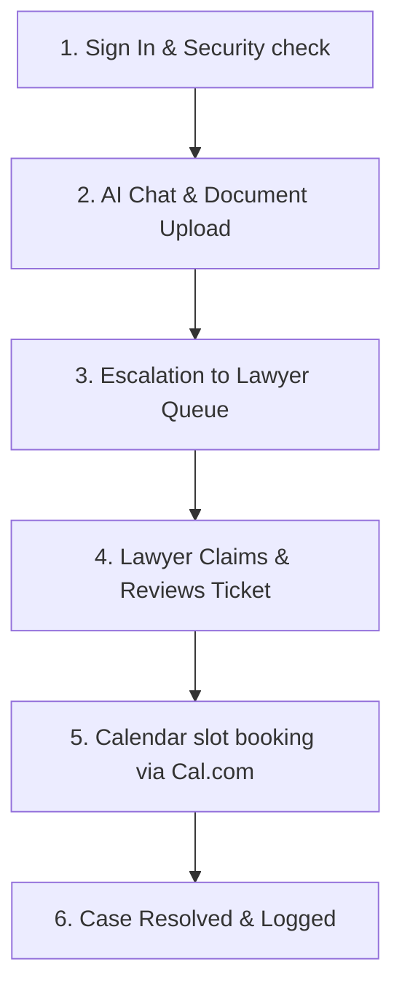

# DigiRett AI Assistant Portal

Welcome to the **DigiRett Frontend** — a modern, professional, and visually stunning web interface designed to make legal guidance simple, fast, and accessible. 

This platform serves as an interactive bridge between users looking for automated legal help, and human lawyers who can step in to provide expert consultations.

---

##  What is DigiRett?

DigiRett is an AI-powered legal assistant portal tailored to help users navigate legal topics easily. 

*   **For Clients**: It offers a direct chat assistant that answers legal questions, reviews uploaded documents, and offers easy booking links to schedule consultations with a lawyer.
*   **For Lawyers**: It provides a dedicated workspace queue to claim cases, review chat logs, and resolve legal tickets.
*   **For Admins & System Admins**: It serves as a management control panel to audit system logs, invite users, manage permissions, and monitor analytics.

---

##  Core Features

Here is what you can do inside the DigiRett portal:

### 1. Chat with the AI Legal Assistant
*   **Instant Answers**: Ask legal questions in natural language and receive real-time answers.
*   **Source Citations**: Every answer includes references to the specific legal acts, documents, or websites used as source material.
*   **Chat History**: Past conversations are saved automatically, allowing you to pick up where you left off.

### 2. Document Upload & Smart Analysis
*   **Document Context**: Upload legal files (`.pdf`, `.docx`, `.doc` up to 20MB) to ask the AI questions about your documents.
*   **Automatic Summaries**: Get a clean summary of uploaded documents automatically.

### 3. Human-in-the-Loop Escalation
*   **Request a Lawyer**: If the AI's response is not sufficient, click **Escalate** to send your conversation logs directly to a professional lawyer.
*   **Ticket Queue**: Lawyers can view, claim, and write resolutions for escalated issues.

### 4. Interactive Booking System
*   **Calendar Schedule**: Once a lawyer claims your ticket, you can view their available time slots and book a video consultation directly inside the portal (powered by Cal.com).

### 5. Management & Analytics Dashboards
*   **User Management**: Administrators can activate, demote, or suspend users, and generate secure invite tokens for new members.
*   **Visual Analytics**: View stats and charts monitoring active requests, resolution speeds, and lawyer rating feedback.

---

## 👥 User Roles & Dashboards

The portal automatically shifts layout depending on who signs in:

| User Role | What they see & do |
| :--- | :--- |
| **Client / User** | Chat page, document upload tool, past history, and meeting scheduler. |
| **Lawyer** | Active queue of escalated tickets, case review screen, and resolved case histories. |
| **Administrator / System Admin** | User status & activation controls, demotions/suspensions, invitation tokens, system audit logs, and detailed SLA/domain analytics. |

---

##  Folder Structure

To keep the application organized, files are grouped logically by their function:

```text
digirett-frontend/
├── public/                 # Static files (like icons and the main index.html file)
├── src/                    # The main source code folder
│   ├── components/         # Reusable blocks of user interface
│   │   ├── auth/           # Login/Signup forms and route-protection guards
│   │   ├── chat/           # Chat composer, message bubbles, library panels, and booking panel
│   │   ├── common/         # Standard buttons, text inputs, error modals, and visual glow layers
│   │   └── layout/         # Header bars, sidebars, and structural templates
│   ├── hooks/              # Custom scripts that manage state and active connections (like chats)
│   ├── lib/                # Configuration files for third-party libraries (like Supabase)
│   ├── pages/              # Individual main screens (Chat page, Lawyer/Admin dashboards, etc.)
│   ├── providers/          # Settings wrapper files (handling theme changes and routing)
│   ├── services/           # Connection wrappers that make requests to our backend APIs
│   ├── styles/             # Stylesheets and visual customization settings
│   ├── utils/              # Standard values, shared rules, and api endpoint URLs
│   ├── App.js              # The central routing file mapping URLs to pages
│   ├── index.js            # The main entry file mounting the application
│   └── index.css           # Global stylesheet containing core design rules
```

---

##  Entire Frontend Workflow

Here is how a user progresses through the system from start to finish:



### Step 1: Sign In & Security Verification
*   **Authentication**: The user signs in using Clerk. The system verifies their credentials and pulls their registered role (Client, Lawyer, Admin, or System Admin).
*   **Redirection**: Based on the role, the app dynamically forwards them to their respective workspace. Suspended users are restricted to a locked notification landing page.

### Step 2: AI Chat & Document Upload
*   **Starting a Conversation**: The client enters a legal query or uploads an attachment.
*   **WebSocket Stream**: The application connects to the backend streaming socket. The client sees the AI's response stream in typewriter-style in real time.
*   **Citations**: The UI highlights source reference links. Users can view underlying source documents directly in their library workspace.

### Step 3: Escalation
*   **Request Assistance**: If the user needs more tailored professional feedback, they fill in an escalation note and click **Escalate**.
*   **Visual Status**: The chat layout locks document uploads, showing an interactive progress status card.

### Step 4: Lawyer Review
*   **Claiming Tickets**: A lawyer signs in to their portal, views the claimable queue, and claims the pending request.
*   **Audit Context**: The lawyer opens the ticket details page to read the full conversation logs and examine files the client uploaded.

### Step 5: Consultations & Bookings
*   **Schedule Meetings**: The client is notified that a lawyer has claimed their case.
*   **Interactive Booking**: The booking block fetches the lawyer's availability and displays a calendar grid. The user chooses a convenient slot to schedule a video conference.

### Step 6: Closeout & Reports
*   **Resolution Logs**: After meeting, the lawyer logs a resolution summary. The ticket is closed.
*   **Admin Audit**: Administrators and System Admins audit performance metrics, SLA response times, and customer ratings on the administrative panel.

---

## Theme & Layout Styling

DigiRett is crafted with high-end modern design principles:
*   **Dark / Light Mode**: Seamlessly switch themes using a toggle button.
*   **Visual Glow Effects**: Smooth glowing backdrops and glass-morphism panels make the interface feel premium and comfortable to read.
*   **Responsive Design**: Optimized for mobile phones, tablets, and desktop displays.

---

## Main Technologies Used

We built this portal using industry-standard tools:
*   **React**: The core framework driving the application.
*   **Tailwind CSS**: A modern design engine used to style pages cleanly.
*   **Clerk**: Provides secure user sign-in, signup, and role controls.
*   **Supabase**: Stores and retrieves your chat logs securely in real-time.
*   **Cal.com API**: Powers the appointment booking slots.

---

##  Developer Setup Guide

Follow these steps to run the application on your computer:

### 1. Install Dependencies
Navigate into the frontend project folder and install the required modules:
```bash
cd frontend/digirett-frontend
npm install
```

### 2. Configure Environment Variables
Create a file named `.env` in the root of the `digirett-frontend` directory and add:
```env
# Authentication Configuration
REACT_APP_CLERK_PUBLISHABLE_KEY=your_clerk_key
REACT_APP_CLERK_SIGN_IN_URL=/sign-in
REACT_APP_CLERK_SIGN_UP_URL=/sign-up
REACT_APP_CLERK_AFTER_SIGN_IN_URL=/
REACT_APP_CLERK_AFTER_SIGN_UP_URL=/

# Backend API endpoint mapping
REACT_APP_API_BASE_URL=http://localhost:8000

# Database Configuration
REACT_APP_SUPABASE_URL=https://your-supabase.supabase.co
REACT_APP_SUPABASE_ANON_KEY=your_supabase_anon_key
```

### 3. Run the App
To start the developer hot-reloading server:
```bash
npm start
```
The application will open automatically at **http://localhost:3000**.

### 4. Build for Production
To bundle the frontend for production hosting:
```bash
npm run build
```
This builds highly optimized, compressed, and minified static assets in the `/build` folder.
