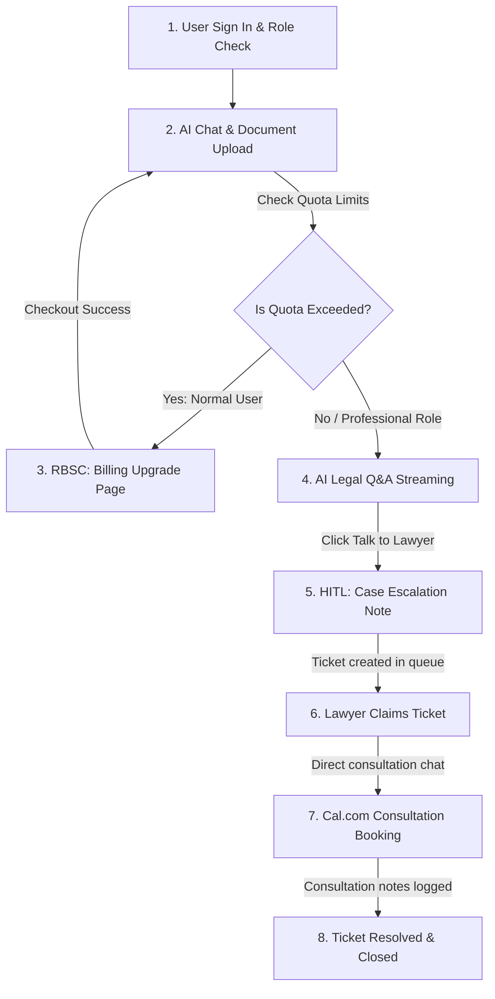

# DigiRett AI Assistant Portal

Welcome to the **DigiRett Frontend** — a modern, professional, and visually stunning web interface designed to make legal guidance simple, fast, and accessible. 

This platform serves as an interactive bridge between users looking for automated legal help, and human lawyers who can step in to provide expert consultations.

---

##  What is DigiRett?

DigiRett is an AI-powered legal assistant portal tailored to help users navigate legal topics easily. 

*   **For Clients**: It offers a direct chat assistant that answers legal questions, reviews uploaded documents, and offers easy booking links to schedule consultations with a lawyer.
*   **For Lawyers**: It provides a dedicated workspace queue to claim cases, review chat logs, and resolve legal tickets.
*   **For Admins & System Admins**: It serves as a management control panel to audit system logs, invite users, manage permissions, and monitor analytics.

---

##  Core Features

Here is what you can do inside the DigiRett portal:

### 1. Chat with the AI Legal Assistant
*   **Instant Answers**: Ask legal questions in natural language and receive real-time answers.
*   **Source Citations**: Every answer includes references to the specific legal acts, documents, or websites used as source material.
*   **Chat History**: Past conversations are saved automatically, allowing you to pick up where you left off.

### 2. Document Upload & Smart Analysis
*   **Document Context**: Upload legal files (`.pdf`, `.docx`, `.doc` up to 20MB) to ask the AI questions about your documents.
*   **Automatic Summaries**: Get a clean summary of uploaded documents automatically.

### 3. Human-in-the-Loop Escalation
*   **Request a Lawyer**: If the AI's response is not sufficient, click **Escalate** to send your conversation logs directly to a professional lawyer.
*   **Ticket Queue**: Lawyers can view, claim, and write resolutions for escalated issues.

### 4. Interactive Booking System
*   **Calendar Schedule**: Once a lawyer claims your ticket, you can view their available time slots and book a video consultation directly inside the portal (powered by Cal.com).

### 5. Management & Analytics Dashboards
*   **User Management**: Administrators can activate, demote, or suspend users, and generate secure invite tokens for new members.
*   **Visual Analytics**: View stats and charts monitoring active requests, resolution speeds, and lawyer rating feedback.

---

## 👥 User Roles & Dashboards

The portal automatically shifts layout depending on who signs in:

| User Role | What they see & do |
| :--- | :--- |
| **Client / User** | Chat page, document upload tool, past history, and meeting scheduler. |
| **Lawyer** | Active queue of escalated tickets, case review screen, and resolved case histories. |
| **Administrator / System Admin** | User status & activation controls, demotions/suspensions, invitation tokens, system audit logs, and detailed SLA/domain analytics. |

---

## Codebase Directory Structure

Detailed directory mapping of the frontend repository:

### 1. Main Pages (`src/pages/`)
* **[AdminDashboard.jsx](src/pages/AdminDashboard.jsx)**: Admin management panel to review user lists, update roles, suspended states, invite new staff, and audit SLA analytics.
* **[BillingPage.jsx](src/pages/BillingPage.jsx)**: Customer billing portal displaying monthly/yearly subscription options, pricing grids, and checkout buttons.
* **[ChatPage.jsx](src/pages/ChatPage.jsx)**: Core client workspace containing AI legal Q&A chats, document attachments review, and payment success celebration modals.
* **[LawyerDashboard.jsx](src/pages/LawyerDashboard.jsx)**: Lawyer workspace displaying matter queues, claimed consultation cases, and case resolution logs.
* **[InvitePage.jsx](src/pages/InvitePage.jsx)**: Public landing portal for newly invited lawyers and administrators to accept organization invites.
* **[ProvisioningPage.jsx](src/pages/ProvisioningPage.jsx)**: Intermediary gate that polls and synchronizes newly accepted roles in Clerk metadata post-registration.
* **[SignInPage.jsx](src/pages/SignInPage.jsx)** / **[SignUpPage.jsx](src/pages/SignUpPage.jsx)**: Login and registration interface wraps built on Clerk.
* **[SuspendedPage.jsx](src/pages/SuspendedPage.jsx)**: Locked landing safety screen displayed if a user account is suspended or deactivated by an administrator.

### 2. Services (`src/services/`)
* **[adminService.js](src/services/adminService.js)**: APIs to query user registers, toggle user roles, deactivations, and generate invite tokens.
* **[api.js](src/services/api.js)**: Configures Axios with base URLs, headers, and request interceptors to communicate with the backend.
* **[calService.js](src/services/calService.js)**: Fetches and configures lawyer calendar slots.
* **[chatService.js](src/services/chatService.js)**: Core WebSockets manager driving real-time message streaming, attachments, and citation mapping.
* **[conversationService.js](src/services/conversationService.js)**: Saves, lists, deletes, and restores chat session history lists.
* **[documentService.js](src/services/documentService.js)**: Manages uploading, parsing, and quota checks for document context attachments.
* **[hitlService.js](src/services/hitlService.js)**: Manages client escalation cases, matter queues, case claims, and resolutions.
* **[inviteService.js](src/services/inviteService.js)**: Verifies valid registration invite tokens.
* **[libraryService.js](src/services/libraryService.js)**: Coordinates user-bookmarked statute libraries and citation folders.
* **[notesService.js](src/services/notesService.js)**: CRUD actions managing private scratchpad notes in the library sidebar.
* **[sourceService.js](src/services/sourceService.js)**: Resolves Lovdata law URLs to human-readable Norwegian legal act titles.
* **[subscriptionService.js](src/services/subscriptionService.js)**: Manages customer billing states in localStorage (isolated by Clerk ID) and dispatches update triggers on status updates.

### 3. Core Components (`src/components/`)
* **[admin/](src/components/admin/)**: UI fragments auditing user ratings, system SLAs, organization invitation records, and audit logs.
* **[auth/](src/components/auth/)**: Safety wrappers (e.g. `RoleGuard.jsx`) protecting routes based on authorized user permission roles.
* **[chat/](src/components/chat/)**: The message log parser, typing bubble, input composer, library attachment drawer, and Cal.com meeting schedulers.
* **[common/](src/components/common/)**: Standard form elements, loading spinners, calendar views, and error dialog overlays.
* **[conversation/](src/components/conversation/)**: Lists, select rules, context dropmenus, and search bars for past chat session logs.
* **[layout/](src/components/layout/)**: Structuring layouts including global headers, responsive sidebars (`Sidebar.jsx`), and app shells (`MainLayout.jsx`).

### 4. Custom React Hooks (`src/hooks/`)
* **[useConversations.js](src/hooks/useConversations.js)**: Centralizes all states for loading, archiving, restoring, deleting, and selecting chat sessions.
* **[useResponsive.js](src/hooks/useResponsive.js)**: Reads responsive screen thresholds (mobile vs tablet vs desktop).

### 5. Providers (`src/providers/`)
* **[ClerkWithRouter.jsx](src/providers/ClerkWithRouter.jsx)**: Integrates Clerk user management context with React Router.
* **[ThemeProvider.jsx](src/providers/ThemeProvider.jsx)**: Holds global dark/light theme choices and updates document classes natively.

### 6. Utilities & Setup (`src/`)
* **[App.js](src/App.js)**: Declares application routes and navigation links.
* **[index.js](src/index.js)**: Mounts the main React DOM node.
* **[index.css](src/index.css)**: Global CSS rules, typography, and styling variables.
* **[utils/constants.js](src/utils/constants.js)**: Standardizes API endpoints, fallback error texts, and default system tags.

---

##  Entire Frontend Workflow

Here is a comprehensive overview of the application workflow lifecycle, demonstrating how AI Chat, Role-Based Subscription Control (RBSC / Billing), and Human-in-the-Loop (HITL) Lawyer Collaboration interact from start to finish:



### Step 1: Signing In
* **Login**: The user logs in. The system automatically identifies if they are a **Client**, **Lawyer**, or **Admin** and opens the correct workspace for them.

### Step 2: Chatting with AI
* **Interactive Chat**: Clients can ask legal questions and upload document attachments. 
* **Instant Answers**: The AI responds instantly and shows the specific law sources used for its answers.

### Step 3: Upgrading your Plan (Subscription & Billing)
* **Limits**: Normal users have a limit of 10 free messages and 2 documents.
* **Upgrades**: To get unlimited access, they click **Upgrade Plan** in the sidebar, choose a monthly or yearly plan, and complete checkout.
* **Unlock**: Once paid, their limits are removed.
* **Exemptions**: Lawyers and Admins have unlimited access and will not see any upgrade buttons or limit notices.

### Step 4: Connecting to a Lawyer
* **Request Help**: If a client needs official legal help, they click **Talk to Lawyer**, write a short summary of their case, and submit.
* **Case Queue**: The case is sent to the lawyer's queue, and the client's chat is paused while they wait.

### Step 5: Live Lawyer Consultation
* **Review & Chat**: A lawyer reviews the request, claims the case, and opens a direct chat with the client.
* **Scheduling**: The lawyer can send a link to schedule a video call using an embedded calendar.

### Step 6: Resolving the Case
* **Close Ticket**: After the consultation, the lawyer writes the resolution details, resolves the case, and closes the ticket.
* **Admin Auditing**: Admins can review case statistics and performance metrics in their admin panel.

---

## Theme & Layout Styling

DigiRett is crafted with high-end modern design principles:
*   **Dark / Light Mode**: Seamlessly switch themes using a toggle button.
*   **Visual Glow Effects**: Smooth glowing backdrops and glass-morphism panels make the interface feel premium and comfortable to read.
*   **Responsive Design**: Optimized for mobile phones, tablets, and desktop displays.

---

## Main Technologies Used

We built this portal using industry-standard tools:
*   **React**: The core framework driving the application.
*   **Tailwind CSS**: A modern design engine used to style pages cleanly.
*   **Clerk**: Provides secure user sign-in, signup, and role controls.
*   **Supabase**: Stores and retrieves your chat logs securely in real-time.
*   **Cal.com API**: Powers the appointment booking slots.

---

##  Developer Setup Guide

Follow these steps to run the application on your computer:

### 1. Install Dependencies
Navigate into the frontend project folder and install the required modules:
```bash
cd frontend/digirett-frontend
npm install
```

### 2. Configure Environment Variables
Create a file named `.env` in the root of the `digirett-frontend` directory and add:
```env
# Authentication Configuration
REACT_APP_CLERK_PUBLISHABLE_KEY=your_clerk_key
REACT_APP_CLERK_SIGN_IN_URL=/sign-in
REACT_APP_CLERK_SIGN_UP_URL=/sign-up
REACT_APP_CLERK_AFTER_SIGN_IN_URL=/
REACT_APP_CLERK_AFTER_SIGN_UP_URL=/

# Backend API endpoint mapping
REACT_APP_API_BASE_URL=http://localhost:8000

# Database Configuration
REACT_APP_SUPABASE_URL=https://your-supabase.supabase.co
REACT_APP_SUPABASE_ANON_KEY=your_supabase_anon_key
```

### 3. Run the App
To start the developer hot-reloading server:
```bash
npm start
```
The application will open automatically at **http://localhost:3000**.

### 4. Build for Production
To bundle the frontend for production hosting:
```bash
npm run build
```
This builds highly optimized, compressed, and minified static assets in the `/build` folder.
