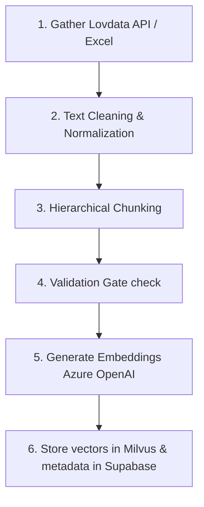

# DigiRett Data Ingestion Pipeline

Welcome to the **DigiRett Data Ingestion Pipeline** — the backend data engine that feeds, cleans, and structures Norwegian legal information for our AI Assistant. 

This pipeline acts as the "brain power" of the DigiRett ecosystem, taking complex legal books, acts, and documents, and transforming them into a format that the AI can search through and understand in seconds.

---

## 🌟 What is the Ingestion Pipeline?

To answer Norwegian law questions accurately, the AI assistant needs access to up-to-date legal databases. 

The Ingestion Pipeline is an automated program that:
1.  **Gathers** raw legal data (from official APIs or offline files).
2.  **Cleans and splits** long legal books into bite-sized text passages.
3.  **Encodes** these passages into mathematical "vector embeddings" (which help the AI search for meaning rather than just keywords).
4.  **Stores** the final results in our database systems so the user chat can search them instantly.

---

## 🔄 Entire Data Workflow & Journey

Here is how data flows through the pipeline from raw law sources to search-ready databases:



### Step 1: Data Gathering (Loaders & Collectors)
*   **API Collector**: Connects to the official **Lovdata API** to fetch Norwegian legal acts in raw XML format.
*   **Offline Loader**: If API access is not active, the system reads client-provided custom Excel spreadsheets containing offline datasets.

### Step 2: Cleaning & Normalization
*   Strips out unneeded formatting tags, extra whitespace, and system annotations from raw files.
*   Converts document formats into normalized, clean plaintext.

### Step 3: Hierarchical Chunking
*   Legal documents are too long to read all at once. The chunker splits documents into smaller overlapping text segments (e.g. 1000 characters with 200 character overlaps).
*   This ensures the AI can quickly retrieve the exact paragraph needed to answer a user's question.

### Step 4: Quality Validation Gate
*   Filters out low-quality text fragments (like blank pages, broken formatting, or short irrelevant sentences) to ensure the AI only references clean, meaningful facts.

### Step 5: Generating Vector Embeddings
*   Uses **Azure OpenAI** (`text-embedding-3-small` model) to turn every text chunk into a "vector" (a series of numbers representing the conceptual meaning of the sentence).

### Step 6: Dual-Database Storage
*   **Milvus (Vector Database)**: Stores the conceptual "vector numbers" to power instant semantic searches.
*   **Supabase (Relational Database)**: Stores the actual text paragraphs, original XML files, and metadata (titles, act dates, authors) for citations.

---

## ⚙️ Ingestion Modes

The pipeline operates in two modes:

| Ingestion Mode | Input Source | Primary Use Case |
| :--- | :--- | :--- |
| **Lovdata API Ingestion (Mode 1)** | Lovdata XML endpoint | Automated daily syncs to fetch official Norwegian law updates. |
| **Client Excel Ingestion (Mode 2)** | Folder containing `.xlsx` datasets | Custom dataset loading, testing, and offline network configurations. |

---

## 📂 Folder Structure

Here is how the pipeline code is organized:

```text
ingestion/
├── collectors/         # Lovdata API connection handlers
├── configs/            # Configuration templates
├── data/               # Local folder storing log archives and client datasets
│   ├── checkpoints/    # Trackers that skip already-processed documents
│   └── Client_dataset/ # Folder containing custom offline Excel sheets
├── src/                # Ingestion source code
│   ├── loaders/        # Adapters to read different file formats (like Excel)
│   ├── processors/     # Text cleanups, chunking, and Azure OpenAI embeddings
│   ├── scheduler/      # Core timer components (runs the process daily)
│   ├── storage/        # Database integration modules (Milvus & Supabase API)
│   ├── main.py         # The primary entry point script
│   └── config.py       # Configuration and credential loader
├── tests/              # Test suites ensuring pipeline accuracy
└── requirements.txt    # Required python library dependencies
```

---

## 🛠️ Main Technologies Used

*   **Language**: Python 3.11+
*   **API Sources**: Lovdata REST API
*   **Embeddings AI**: Azure OpenAI (`text-embedding-3-small`)
*   **Vector Search**: Milvus Database
*   **Metadata DB**: Supabase (PostgreSQL)
*   **Scheduler**: APScheduler (built-in cron support)

---

## 💻 Developer Setup Guide

Follow these steps to run the pipeline on your computer:

### 1. Configure Python Environment
Create a virtual environment and install the required modules:
```bash
# Navigate to the ingestion folder
cd ingestion

# Create and activate environment
python -m venv venv
# On Windows:
venv\Scripts\activate
# On Mac/Linux:
source venv/bin/activate

# Install libraries
pip install -r requirements.txt
```

### 2. Configure Environment Variables
Create a file named `.env` in the root of the `ingestion` folder and add:
```env
# Ingestion Base
LOVDATA_BASE_URL=https://api.lovdata.no

# Database Storage Keys
MILVUS_HOST=your-milvus-host
MILVUS_PORT=19530
MILVUS_COLLECTION=digirett-vectors

SUPABASE_SERVICE_KEY=your-supabase-service-key
SUPABASE_BUCKET=digirett-storage

# AI Embeddings
AZURE_OPENAI_ENDPOINT=https://your-resource.cognitiveservices.azure.com/
AZURE_OPENAI_KEY=your-azure-key
AZURE_OPENAI_DEPLOYMENT=text-embedding-3-small

# Offline Mode (Optional)
XL_DATASET_FOLDER=D:\path\to\Client_dataset
```

### 3. Run Ingestion
To launch the ingestion cycle manually:
```bash
python src/main.py
```

### 4. Run Scheduler
To run the automated scheduler task (which syncs legal sources every night):
```bash
python src/scheduler/cron_scheduler.py
```