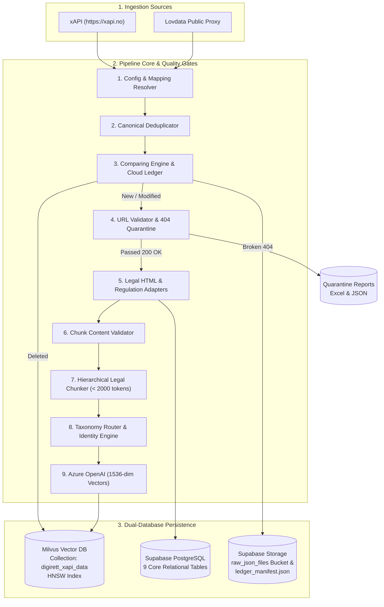

# DigiRett Ingestion Pipeline

**Production Ingestion, Processing, Classification & Storage Layer**

The DigiRett ingestion pipeline continuously converts Norwegian legal source material into normalized, classified, searchable legal intelligence used by the DigiRett AI Agent.

---

## Validation Snapshot

| Item                          | Value                             |
| :---------------------------- | :-------------------------------- |
| Last Functional Validation    | 31 August 2026                    |
| Core Architecture Subsystems  | 15 Subsystems                     |
| Automated Test Suites / Files | 16 Test Files                     |
| Automated Tests Executed      | 83 Tests                          |
| Passed                        | 83 Passed                         |
| Failed                        | 0 Failed                          |
| Pass Rate                     | 100% PASS (13.59s execution time) |

---

## Table of Contents

1. [Overview](#1-overview)
2. [Architecture at a Glance](#2-architecture-at-a-glance)
3. [End-to-End Data Flow](#3-end-to-end-data-flow)
4. [Repository Structure](#4-repository-structure)
5. [Core Production Subsystems](#5-core-production-subsystems)
6. [Configuration & Environment Variables](#6-configuration-environment-variables)
7. [Legal Domain Mapping](#7-legal-domain-mapping)
8. [Canonical Identity Model](#8-canonical-identity-model)
9. [Change Detection Model](#9-change-detection-model)
10. [Storage Architecture: Dual-Database Model](#10-storage-architecture-dual-database-model)
11. [Storage Ledger Lifecycle](#11-storage-ledger-lifecycle)
12. [Milvus Vector Storage](#12-milvus-vector-storage)
13. [Normalized Intermediate Data](#13-normalized-intermediate-data)
14. [Legal Parsing Architecture](#14-legal-parsing-architecture)
15. [Chunking Strategy](#15-chunking-strategy)
16. [Chunk Quality Gate](#16-chunk-quality-gate)
17. [Taxonomy Routing Precedence](#17-taxonomy-routing-precedence)
18. [Embedding Pipeline](#18-embedding-pipeline)
19. [URL Validation & Quarantine Gate](#19-url-validation-quarantine-gate)
20. [Document Lifecycle](#20-document-lifecycle)
21. [Batch Processing & Crash Recovery](#21-batch-processing-crash-recovery)
22. [Idempotency Design](#22-idempotency-design)
23. [Deletion Safety](#23-deletion-safety)
24. [Command Reference & Runbook](#24-command-reference-runbook)
25. [Installation & Environment Setup](#25-installation-environment-setup)
26. [Pre-Flight Verification Checklist](#26-pre-flight-verification-checklist)
27. [Automated Testing & Verification](#27-automated-testing-verification)
28. [Automated Test Inventory](#28-automated-test-inventory)
29. [Production Troubleshooting Guide](#29-production-troubleshooting-guide)
30. [Security & Secrets Management](#30-security-secrets-management)
31. [Glossary](#31-glossary)
32. [Maintenance & Safe Change Guidelines](#32-maintenance-safe-change-guidelines)

---

## 1. Overview

### 1.1 Purpose

The DigiRett ingestion pipeline is the production data-processing layer responsible for collecting Norwegian legal documents from xAPI (`https://xapi.no`), normalizing statutory and regulatory content, detecting differential changes, validating source URLs, generating hierarchical legal chunks, classifying those chunks against DigiRett's legal taxonomy, generating Azure OpenAI embeddings, and persisting the resulting intelligence into Milvus Vector DB and Supabase PostgreSQL.

The pipeline is designed for repeatable and incremental execution while maintaining deterministic document identities, duplicate protection, deletion detection, checkpoint recovery, URL quarantine, and cloud storage-ledger consistency.

### 1.2 Core Responsibilities

- **Harvesting** — Ingest legal documents, acts, and regulations from xAPI with pagination and backoff.
- **Domain Resolution** — Map Norwegian legal areas (*rettsområder*) to the 12 DigiRett commercial legal domains.
- **Canonical Normalization** — Standardize statutory acts (`NL/lov/...`) and delegated regulations (`SF/forskrift/...`).
- **Deduplication** — Collapse overlapping central regulations and law-linked regulations into unique entities.
- **Change Detection** — Compare incoming documents against previously ingested states using content hashing.
- **Differential Tracking** — Identify new, modified, unchanged, and deleted documents.
- **URL Verification & Quarantine** — Audit Lovdata URLs (HTTP 200, 302, 404, 500, timeouts) and isolate broken links.
- **Legal HTML Parsing** — Cleanly parse complex statutory sections, *ledd*, *punktum*, and nested sub-points without duplication.
- **Unstructured Regulation Parsing** — Adapt legacy regulations with inline bold headers, Roman numerals, tables, and annexes.
- **Quality Filtering** — Reject repeal notices (*opphevet ved lov...*), empty strings, and TOC range headers.
- **Hierarchical Chunking** — Enforce strict BPE token bounds (< 2,000 tokens) with 200-token sliding overlaps.
- **Taxonomy Routing** — Assign primary and secondary subdomains, B2B/B2C relationships, and jurisdiction tags.
- **Deterministic Identity** — Generate immutable chunk IDs across ingestion cycles.
- **Vector Embedding** — Generate 1536-dimensional embeddings via Azure OpenAI (`text-embedding-3-small`).
- **Dual-Storage Persistence** — Insert vectors into Milvus (HNSW index) and relational metadata into Supabase (9 tables).
- **Ledger Consistency** — Maintain the cloud storage ledger (`raw_json_files/ledger_manifest.json`) batch by batch.
- **Operational Execution** — Support dry-run, incremental, domain-filtered, and automated cron scheduling.

---

## 2. Architecture at a Glance



---

## 3. End-to-End Data Flow

During an operational ingestion run, documents flow through a 20-step lifecycle:

```text
1.  Configuration Loading      Load settings, credentials, and verify filesystem directories.
2.  Domain Plan Generation     Parse rettsomrade_domain_mapping.json into 12 domain plans.
3.  xAPI Discovery             Harvest active laws and regulations for target rettsområder.
4.  Canonical ID Generation    Assign authoritative IDs (NL/lov/... and SF/forskrift/...).
5.  Deduplication              Merge overlapping central and law-linked regulations.
6.  Ledger Lookup              Fetch master ledger_manifest.json from Supabase Storage once.
7.  Content Hashing            Compute MD5/SHA256 fingerprints of incoming document content.
8.  Change Detection           Classify into NEW, MODIFIED, UNCHANGED, or DELETED.
9.  URL Validation Gate        Probe Lovdata URLs (HTTP HEAD) concurrently; isolate 404s.
10. HTML / Text Parsing        Strip UI tags and metadata from legislative HTML articles.
11. Legal Section Extraction   Convert paragraphs and provisions into NormalizedLegalSection.
12. Chunk Quality Validation   Filter out repeal stubs, empty text, and TOC headers.
13. Hierarchical Chunking      Split oversized blocks at 2,000 tokens with 200-token overlap.
14. Taxonomy Routing           Assign legal domain, subdomains, B2B/B2C, and deterministic chunk ID.
15. Embedding Generation       Generate 1536-dimensional vectors via Azure OpenAI.
16. Milvus Persistence         Insert vectors and chunk payloads into HNSW-indexed collection.
17. Supabase Persistence       Upsert document metadata, sections, and run audit items to PostgreSQL.
18. Ledger In-Memory Update    Update document state to SYNCED with new content hash.
19. Batch Checkpoint Commit    Atomically save batch state and commit ledger_manifest.json.
20. Run Reporting              Export taxonomy Excel review report and final ingestion summary.
```

---

## 4. Repository Structure

```text
ingestion/
├── README.md                                   # Production operations manual and architecture runbook.
├── requirements.txt                            # Pinned Python dependencies.
│
├── collectors/                                 # External API harvesting clients.
│   └── xapi_collector.py                       # Async HTTP client interfacing with https://xapi.no.
│
├── configs/                                    # Runtime configuration and domain registries.
│   ├── rettsomrade_domain_mapping.json         # 67 mapped commercial areas, 208 out-of-scope areas.
│   └── taxonomies/                             # JSON definitions for the 12 commercial legal domains.
│
├── adapters/                                   # Structural parsers for statutory law and regulations.
│   ├── law_section_adapter.py                  # Parses statutory laws into NormalizedLegalSection.
│   └── regulation_section_adapter.py           # Handles structured and unstructured regulation HTML.
│
├── schema/                                     # Vector database schema definitions.
│   └── milvus_schema.py                        # CollectionSchema and field definitions for Milvus.
│
├── models/                                     # Pydantic and dataclass domain schemas.
│   ├── legal_section.py                        # NormalizedLegalSection and EnrichedMilvusChunk.
│   ├── legal_domain.py                         # Taxonomy domain and subdomain structures.
│   └── ingestion_models.py                     # Checkpoint, run metrics, and ledger data models.
│
├── validation/                                 # Pre-storage quality assurance gates.
│   └── url_validator.py                        # Multithreaded Lovdata URL probe and 404 quarantine gate.
│
├── data/                                       # Local runtime artifacts (gitignored).
│   ├── checkpoints/                            # Atomic batch commit state files (checkpoint_batch_*.json).
│   ├── normalized/                             # Normalized JSONL intermediate exports (5 datasets).
│   ├── reports/                                # URL quarantine and taxonomy review Excel reports.
│   └── logs/                                   # Rotated execution and error logs.
│
├── src/                                        # Core application source code.
│   ├── main.py                                 # RealTimePipelineRunner CLI orchestrator.
│   ├── config.py                               # Pydantic Settings and environment validation.
│   ├── processors/                             # Data processing engines.
│   │   ├── batch_checkpoint_manager.py         # Atomic batch state management and crash recovery.
│   │   ├── comparing_engine.py                 # Differential change detection and ledger manager.
│   │   ├── deduplicator.py                     # Multi-area law deduplication engine.
│   │   ├── embedder.py                         # TokenAwareAzureEmbedder implementation.
│   │   └── embeddings.py                       # Azure OpenAI embedding generator and pacing.
│   ├── chunking/                               # Semantic chunking, validation, and classification.
│   │   ├── chunk_validator.py                  # Filters non-substantive stubs, repeal notices, and TOC headers.
│   │   ├── legal_chunker.py                    # BPE token-bounded hierarchical legal chunker.
│   │   └── taxonomy_router.py                  # Keyword, fuzzy, and optional AI taxonomy routing.
│   ├── storage/                                # Database and vector storage interfaces.
│   │   ├── milvus_store.py                     # Milvus collection management and vector indexing.
│   │   └── supabase_store.py                   # Supabase PostgreSQL tables and bucket storage manager.
│   ├── scheduler/                              # Automated cron scheduling.
│   │   └── cron_scheduler.py                   # Mutex file-locking background cron daemon.
│   ├── tools/                                  # Review and inspection utilities.
│   │   └── review_exporter.py                  # Excel workbook export for taxonomy review items.
│   └── utils/                                  # Export utilities and normalizers.
│       └── jsonl_exporter.py                   # FormatNormaliser for JSONL dataset exports.
│
└── tests/                                      # 16 automated test suites (83 unit & integration tests).
    ├── conftest.py                             # Test fixtures and environment mocks.
    ├── test_config.py                          # Subsystem 1:  Configuration & Environment.
    ├── test_batch_checkpoint_manager.py        # Subsystem 2:  Batch Checkpoint Manager.
    ├── test_chunk_validator.py                 # Subsystem 3:  Chunk Content Validator.
    ├── test_comparing_engine.py                # Subsystem 4:  Comparing Engine & Ledger.
    ├── test_deduplication_integration.py       # Subsystem 5:  Canonical Deduplicator.
    ├── test_domain_mapping_fallback.py         # Subsystem 6:  Domain Mapping & Fallback.
    ├── test_embedding.py                       # Subsystem 7:  Azure OpenAI Embeddings.
    ├── test_legal_adapters.py                  # Subsystem 8:  Legal HTML Adapters.
    ├── test_unstructured_regulation_adapter.py # Subsystem 9:  Irregular Regulation Adapter.
    ├── test_legal_chunker.py                   # Subsystem 10: Hierarchical Legal Chunker.
    ├── test_milvus_store.py                    # Subsystem 11: Milvus Vector Database.
    ├── test_supabase_store.py                  # Subsystem 12: Supabase PostgreSQL Store.
    ├── test_taxonomy_router.py                 # Subsystem 13: Taxonomy Keyword Routing.
    ├── test_taxonomy_and_id.py                 # Subsystem 13: Deterministic IDs & Metadata.
    ├── test_url_validator.py                   # Subsystem 14: URL Validation & Quarantine.
    └── test_scheduler.py                       # Subsystem 15: Cron Scheduler & Mutex Lock.
```

---

## 5. Core Production Subsystems

### 5.1 Configuration & Typed Environment Management

- **Purpose**: Load application settings, validate environment variables, provision directories, and compile domain execution plans.
- **Responsibilities**: Validate `.env` via Pydantic without hardcoded fallbacks, ensure paths exist (`checkpoints/`, `normalized/`, `reports/`, `logs/`), load client mapping file.
- **Primary Implementation**: `src/config.py`
- **Automated Validation**: `tests/test_config.py` (5 tests)
- **Production Considerations**: Fails fast on startup if database credentials or connection keys are missing.

### 5.2 Batch Checkpoint Manager

- **Purpose**: Partition document workloads into manageable groups (default: 50 documents) and maintain crash-resilient state.
- **Responsibilities**: Atomic `.tmp` writes, skip already-committed documents upon restart, record chunk and vector counts.
- **Primary Implementation**: `src/processors/batch_checkpoint_manager.py`
- **Automated Validation**: `tests/test_batch_checkpoint_manager.py` (1 test)
- **Production Considerations**: Allows successfully committed documents to be skipped during restart, reducing duplicate re-processing after interrupted runs.

### 5.3 Chunk Quality & Noise Validator

- **Purpose**: Prevent non-substantive text, empty strings, and boilerplate from entering storage.
- **Responsibilities**: Reject repeal stubs (*"Opphevet ved lov..."*), filter TOC range headers, retain definitions (*"Med arbeidstaker menes..."*).
- **Primary Implementation**: `src/chunking/chunk_validator.py`
- **Automated Validation**: `tests/test_chunk_validator.py` (5 tests)
- **Production Considerations**: Eliminates low-value vector noise that degrades retrieval precision.

### 5.4 Differential Comparing Engine & Cloud Ledger

- **Purpose**: Compare harvested documents against the cloud storage ledger to identify changes and eliminate redundant processing.
- **Responsibilities**: Hash comparison, categorize into NEW, MODIFIED, UNCHANGED, DELETED, update in-memory ledger, commit batch-by-batch.
- **Primary Implementation**: `src/processors/comparing_engine.py`
- **Automated Validation**: `tests/test_comparing_engine.py` (1 test)
- **Production Considerations**: Avoids unnecessary embedding calls for documents classified as unchanged, reducing processing time and embedding API consumption during incremental runs.

### 5.5 Canonical Law & Regulation Deduplicator

- **Purpose**: Merge laws and regulations discovered across multiple legal areas into unified canonical entities.
- **Responsibilities**: Collapse duplicates, merge parent-law linkages, preserve relationship metadata under single canonical IDs.
- **Primary Implementation**: `src/processors/deduplicator.py`
- **Automated Validation**: `tests/test_deduplication_integration.py` (1 test)
- **Production Considerations**: Prevents indexing multiple identical acts when an act governs several *rettsområder*.

### 5.6 Client Domain Mapping & Live Fallback Engine

- **Purpose**: Resolve commercial legal domains for Norwegian *rettsområder*.
- **Responsibilities**: Load primary client JSON mapping (67 mapped, 208 out-of-scope), support CLI filtering (`--domain`), fall back to live discovery.
- **Primary Implementation**: `src/main.py`
- **Automated Validation**: `tests/test_domain_mapping_fallback.py` (3 tests)
- **Production Considerations**: Excludes criminal and public areas outside client business scope.

### 5.7 Azure OpenAI Vector Embedding

- **Purpose**: Convert text chunks into 1536-dimensional semantic vectors.
- **Responsibilities**: Model `text-embedding-3-small`, exponential backoff on HTTP 429 rate limits, validate vector shapes.
- **Primary Implementation**: `src/processors/embeddings.py`
- **Automated Validation**: `tests/test_embedding.py` (5 tests)
- **Production Considerations**: Rejects empty inputs and validates float dimensions before database insertion.

### 5.8 Legal HTML Parser & Statutory Law Adapter

- **Purpose**: Convert statutory law HTML into structured `NormalizedLegalSection` instances.
- **Responsibilities**: Clean HTML, extract *ledd*, *punktum*, and *bokstav* without text duplication, mark repealed provisions.
- **Primary Implementation**: `adapters/law_section_adapter.py`
- **Automated Validation**: `tests/test_legal_adapters.py` (5 tests)
- **Production Considerations**: Falls back cleanly to plain text `innhold_text` if HTML is absent.

### 5.9 Unstructured Regulation Adapter

- **Purpose**: Parse legacy, irregularly formatted Norwegian delegated regulations.
- **Responsibilities**: Extract inline bold headers, jammed paragraph numbers, Roman numeral chapters, tables, and annexes safely.
- **Primary Implementation**: `adapters/regulation_section_adapter.py`
- **Automated Validation**: `tests/test_unstructured_regulation_adapter.py` (7 tests)
- **Production Considerations**: Includes safeguard caps to prevent infinite parsing loops on oversized annexes.

### 5.10 Hierarchical Legal Chunker

- **Purpose**: Split legal sections into retrieval-ready chunks while preserving context.
- **Responsibilities**: Enforce 2,000-token maximum with 200-token overlap, prefer structural boundaries (*ledd*), fall back to sentences and words.
- **Primary Implementation**: `src/chunking/legal_chunker.py`
- **Automated Validation**: `tests/test_legal_chunker.py` (5 tests)
- **Production Considerations**: Uses `tiktoken` (`cl100k_base`) to ensure token bounds match OpenAI embedding model limits.

### 5.11 Milvus Vector Database Store

- **Purpose**: Index and search vector embeddings.
- **Responsibilities**: Manage collection `digirett_xapi_data`, configure HNSW index, validate vector dimensions (1536), execute expression deletes.
- **Primary Implementation**: `src/storage/milvus_store.py`
- **Automated Validation**: `tests/test_milvus_store.py` (6 tests)
- **Production Considerations**: Flushes collection after batch insertion and purge operations.

### 5.12 Supabase PostgreSQL Store

- **Purpose**: Store relational legislative metadata, sections, and execution run logs across 9 tables.
- **Responsibilities**: Idempotent client connections, XML/JSON bucket downloads, batch metadata upserts.
- **Primary Implementation**: `src/storage/supabase_store.py`
- **Automated Validation**: `tests/test_supabase_store.py` (9 tests)
- **Production Considerations**: Uses service role authentication; isolates client instances.

### 5.13 Taxonomy Router & Deterministic Identity Engine

- **Purpose**: Assign domain/subdomain taxonomy tags and generate reproducible chunk IDs.
- **Responsibilities**: Keyword matching, fuzzy evaluation, optional AI arbitration, deterministic ID formulation (`<doc>__<sec>__<domain>__<subdomain>__<idx>`).
- **Primary Implementation**: `src/chunking/taxonomy_router.py`
- **Automated Validation**: `tests/test_taxonomy_router.py` + `tests/test_taxonomy_and_id.py` (7 tests)
- **Production Considerations**: Deterministic IDs ensure identical input replaces the exact same vector slot.

### 5.14 URL Validation & 404 Quarantine Gate

- **Purpose**: Audit source Lovdata URLs and prevent broken links from contaminating databases.
- **Responsibilities**: Concurrently probe URLs via HTTP HEAD (200, 302, 404, 500, timeout), quarantine broken documents, export multi-tab Excel and JSON reports.
- **Primary Implementation**: `validation/url_validator.py`
- **Automated Validation**: `tests/test_url_validator.py` (15 tests)
- **Production Considerations**: Automatically excludes amendatory acts with dead Lovdata URLs from downstream vector indexing.

### 5.15 Background Scheduler & Mutex Locking

- **Purpose**: Coordinate unattended nightly synchronization runs.
- **Responsibilities**: Acquire process mutex lock (`scheduler.lock`), persist run status to `scheduler_state.json`, recover from corrupted state files.
- **Primary Implementation**: `src/scheduler/cron_scheduler.py`
- **Automated Validation**: `tests/test_scheduler.py` (8 tests)
- **Production Considerations**: Rejects duplicate job executions when a prior sync is actively running.

---

## 6. Configuration & Environment Variables

Create a `.env` file in the `ingestion/` root directory:

| Variable                  | Required | Purpose                                      | Production Example                                      |
| :------------------------ | :------: | :------------------------------------------- | :------------------------------------------------------ |
| `XAPI_BASE_URL`           | Yes      | Endpoint proxy for Lovdata legislation API   | `https://xapi.no`                                       |
| `AZURE_OPENAI_ENDPOINT`   | Yes      | Azure OpenAI service endpoint URL            | `https://<azure-resource>.cognitiveservices.azure.com/` |
| `AZURE_OPENAI_KEY`        | Yes      | Azure Cognitive Services subscription key    | `<secret-api-key>`                                      |
| `AZURE_OPENAI_DEPLOYMENT` | Yes      | Azure OpenAI deployment model name           | `text-embedding-3-small`                                |
| `MILVUS_HOST`             | Yes      | Host/IP address of the Milvus cluster        | `<milvus-host-or-ip>`                                   |
| `MILVUS_PORT`             | Yes      | Port for Milvus gRPC communication           | `19530`                                                 |
| `MILVUS_COLLECTION`       | Yes      | Target collection name for legal vectors     | `digirett_xapi_data`                                    |
| `SUPABASE_URL`            | Yes      | Supabase PostgreSQL project URL              | `https://<project-ref>.supabase.co`                     |
| `SUPABASE_KEY`            | Yes      | Supabase Service Role Key (server-side only) | `<secret-service-role-key>`                             |
| `SUPABASE_BUCKET`         | Yes      | Cloud storage bucket for raw XML/JSON        | `raw_json_files`                                        |
| `DOCUMENT_BATCH_SIZE`     | Yes      | Processing batch size (from .env)            | `50`                                                    |
| `MILVUS_BATCH_SIZE`       | Yes      | Milvus vector insertion batch size           | `100`                                                   |
| `MILVUS_MAX_RETRIES`      | Yes      | Maximum Milvus insertion retries             | `3`                                                     |
| `MILVUS_DIMENSION`        | Yes      | Embedding vector dimension                   | `1536`                                                  |
| `MILVUS_METRIC_TYPE`      | Yes      | Distance metric                              | `COSINE`                                                |
| `MILVUS_INDEX_TYPE`       | Yes      | Vector index algorithm                       | `HNSW`                                                  |

---

## 7. Legal Domain Mapping

The commercial scope is defined in `configs/rettsomrade_domain_mapping.json`.

**12 Commercial Legal Domains:**

1.  `D01_CORPORATE`    — Corporate & Company Law
2.  `D02_IP`           — Intellectual Property Law
3.  `D03_TAX`          — Tax & Fiscal Law
4.  `D04_CONTRACT`     — Contract & Commercial Obligations
5.  `D05_PRIVACY`      — Data Protection & GDPR
6.  `D06_COMPLIANCE`   — Regulatory Compliance
7.  `D07_REAL_ESTATE`  — Real Estate & Property Law
8.  `D08_PROCUREMENT`  — Public Procurement Law
9.  `D09_DISPUTE`      — Dispute Resolution & Litigation
10. `D10_FINANCIAL`    — Banking & Financial Regulations
11. `D11_INSOLVENCY`   — Bankruptcy & Restructuring
12. `D12_EMPLOYMENT`   — Employment, Labor & Work Environment

**Mapping Scope:**

- **67 Mapped Legal Areas** — Explicitly associated with one or more commercial domains.
- **208 Out-of-Scope Areas** — Criminal law (*Strafferett*), family law, immigration, etc., are excluded from business ingestion.
- **Fallback** — If the mapping file is missing, the pipeline queries xAPI live while maintaining exclusion of the 208 non-commercial areas.

---

## 8. Canonical Identity Model

Deterministic identifiers ensure that repeated runs update existing records rather than creating duplicates:

| Level    | Identifier Variable     | Formatting Pattern / Generation Logic                                                                                           |
| :------- | :---------------------- | :------------------------------------------------------------------------------------------------------------------------------ |
| Document | `canonical_document_id` | Laws: `NL/lov/<year>-<month>-<day>-<nr>` &nbsp;•&nbsp; Regulations: `SF/forskrift/<year>-<month>-<day>-<nr>`                    |
| Section  | `source_section_key`    | `<canonical_document_id>/<section_number>` (e.g. `NL/lov/2005-06-17-62/§ 1-1`)                                                  |
| Chunk    | `chunk_id`              | `<canon_id>__<sec_id>__<domain>__<subdomain>__<chunk_idx>` — all slashes, spaces, and section symbols replaced with underscores |

---

## 9. Change Detection Model

Document comparison state machine:

| Document State | Detection Criteria                                                        | Pipeline Action                                                        |
| :------------- | :------------------------------------------------------------------------ | :--------------------------------------------------------------------- |
| NEW            | Document ID not found in `ledger_manifest.json`                           | Fully harvested, parsed, chunked, embedded, and indexed.               |
| MODIFIED       | Document ID exists, but `content_hash` or `last_amended_date` has changed | Prior vector chunks purged from Milvus; re-processed and updated.      |
| UNCHANGED      | Document ID exists and `content_hash` matches                             | Skipped; avoids redundant embedding calls and database writes.         |
| DELETED        | Document previously tracked in ledger but absent from discovery           | Vector chunks purged from Milvus; marked inactive in ledger.           |
| QUARANTINED    | Document failed URL validation (HTTP 404)                                 | Logged to quarantine Excel/JSON reports; excluded from vector storage. |

---

## 10. Storage Architecture: Dual-Database Model

The pipeline utilizes a dual-database architecture:

1. **Supabase PostgreSQL** — Relational legal intelligence, case metadata, section hierarchy, and audit trails.
2. **Milvus Vector DB** — 1536-dimensional semantic retrieval index.

### 10.1 The 9 Supabase PostgreSQL Tables

| Table Name                 | Primary Role & Description                                                        |
| :------------------------- | :-------------------------------------------------------------------------------- |
| `taxonomy_domains`         | Master list of the 12 commercial legal domains.                                   |
| `taxonomy_subdomains`      | Granular sub-domain taxonomy definitions (e.g., `EL-01`, `EL-03`).                |
| `xapi_rettsomrade_catalog` | Live registry of all 283 Norwegian *rettsområder* discovered from xAPI.           |
| `rettsomrade_mappings`     | Client mapping relationships connecting *rettsområder* to commercial domains.     |
| `legal_documents`          | Master table of statutory acts and regulations (titles, dates, status, hashes).   |
| `legal_sections`           | Granular statutory provisions, paragraphs, and structured *ledd* blocks.          |
| `law_regulation_map`       | Authoritative linkages connecting statutory acts to their delegated regulations.  |
| `ingestion_runs`           | High-level audit logs of every sync execution (start time, metrics, exit status). |
| `ingestion_run_items`      | Per-document audit trail (HTTP status, hash, stage, timestamp).                   |

### 10.2 Supabase Storage Bucket (`raw_json_files`)

- **Raw Document Archive** — Backs up raw source JSON payloads fetched from xAPI.
- **Storage Ledger** — Stores `ledger_manifest.json`.

---

## 11. Storage Ledger Lifecycle

The ledger file `ledger_manifest.json` tracks content hashes and status:

```json
{
  "ledger_version": "2.0.0",
  "last_synced_at": "2026-08-31T10:14:12Z",
  "total_documents": 746,
  "documents": {
    "NL/lov/2005-06-17-62": {
      "canonical_document_id": "NL/lov/2005-06-17-62",
      "title": "Lov om arbeidsmiljø (arbeidsmiljøloven)",
      "content_file_hash": "cd507cad052f68b5",
      "last_amended_date": "2024-07-01",
      "paragraph_count": 156,
      "vdb_status": "SYNCED"
    }
  }
}
```

**Operational Rules:**

1. **Startup (Load Once)** — The ledger is downloaded once from the bucket into an in-memory dictionary for O(1) change detection.
2. **Processing** — Document states are updated in-memory during batch execution.
3. **Commit (Batch-by-Batch)** — At the end of every 50-document batch, `comparing_engine.save_ledger()` uploads the manifest back to Supabase Storage.

---

## 12. Milvus Vector Storage

| Parameter        | Production Configuration       |
| :--------------- | :----------------------------- |
| Collection Name  | `digirett_xapi_data`           |
| Vector Dimension | `1536`                         |
| Distance Metric  | `COSINE`                       |
| Index Type       | `HNSW`                         |
| Index Parameters | `M: 16`, `efConstruction: 200` |
| Search Parameter | `ef: 64`                       |

---

## 13. Normalized Intermediate Data

During execution, `FormatNormaliser` writes 5 JSONL files to `data/normalized/` for inspection and offline evaluation:

| File Name                     | Purpose                                                             |
| :---------------------------- | :------------------------------------------------------------------ |
| `laws.jsonl`                  | Canonical statutory act metadata records.                           |
| `law_paragraphs.jsonl`        | Normalized law provisions stripped of UI markup.                    |
| `regulations.jsonl`           | Central and secondary regulation metadata.                          |
| `regulation_provisions.jsonl` | Parsed regulation provisions from structured/unstructured adapters. |
| `chunks.jsonl`                | Final AI-ready chunk records with taxonomy tags and embeddings.     |

> **Note:** These files serve as staging and debugging artifacts; Supabase and Milvus remain the primary query layers.

---

## 14. Legal Parsing Architecture

```text
Law Document
 └─ LawSectionAdapter
       └─ Statutory sections, ledd, punktum, and bokstav sub-points

Regulation Document
 └─ RegulationSectionAdapter
       ├─ Standard HTML Parser (article.legalArticle)
       └─ Unstructured Regulation Adapter (fallback for irregular regulations)
             ├─ Type 1: Inline bold section headers (<b>§ 1.</b>)
             ├─ Type 2: Jammed headers without whitespace (§ 1-1 Formål)
             ├─ Type 3: Roman numeral structures (Kapittel I, II, III)
             ├─ Type 4: HTML tables and list hierarchies
             └─ Type 5: Safeguard for oversized annexes
```

---

## 15. Chunking Strategy

Strict token-bounded hierarchical splitting via `tiktoken` (`cl100k_base`):

```text
Legal Section
     |
     |-- <= 2,000 tokens ------------> Stays whole as 1 semantic unit
     |
     `-- > 2,000 tokens
             |
             v
       Structural split (ledd, list items) + 200-token sliding overlap
             |
             v
       (If block still > 2,000 tokens) ----> Sentence-boundary fallback
             |
             v
       (If sentence still > 2,000 tokens) --> Word-boundary fallback
```

---

## 16. Chunk Quality Gate

| Evaluated Text                                            | Gate Decision | Reason                               |
| :-------------------------------------------------------- | :-----------: | :----------------------------------- |
| Legal definition (*"Med arbeidstaker menes..."*)          | KEPT          | Legitimate legal definition.         |
| Statutory conditions (*"Loven gjelder ikke..."*)          | KEPT          | Operative statutory rule.            |
| Repeal notices (*"Opphevet ved lov 17 juni 2005 nr. 62"*) | REJECTED      | Non-substantive repeal stub.         |
| Table-of-contents range (*"Kapittel 3 § 12 - § 18"*)      | REJECTED      | Indexing header without legal rules. |
| Empty text or whitespace                                  | REJECTED      | Zero semantic value.                 |

---

## 17. Taxonomy Routing Precedence

1. **Explicit Keyword Matching** — Rapid search for statutory terminology (e.g. *arbeidsavtale*, *oppsigelse*).
2. **Fuzzy String Matching** — High-confidence scoring against subdomain keyword lists.
3. **Optional AI Arbitration** — Evaluated when multiple subdomains conflict or confidence is marginal.
4. **Metadata Enrichment** — Injects `jurisdiction` (`NORWAY`, `EEA`, `BOTH`), `b2b_b2c_types` (`B2B`, `B2C`), and `relationship_types`.

---

## 18. Embedding Pipeline

```text
Validated Chunk
      |
      v
Azure OpenAI (text-embedding-3-small)
      |   (HTTP 429 backoff retry if rate-limited)
      v
1536-Dimensional Float Vector
      |
      v
Shape & Dimension Validation (re-flatten nested vectors, reject != 1536)
      |
      v
Insert into Milvus Collection (HNSW Index)
```

---

## 19. URL Validation & Quarantine Gate

Audits Lovdata URLs via multi-threaded HTTP HEAD requests before storage:

| Response / Status | System Classification   | Action                                                       |
| :---------------- | :---------------------- | :----------------------------------------------------------- |
| HTTP 200          | `FULLY_WORKING`         | Document approved for downstream chunking & vector indexing. |
| HTTP 302          | `REDIRECT`              | Redirect target URL tracked and updated.                     |
| HTTP 404          | `XAPI_DATA_LOVDATA_404` | QUARANTINED — excluded from Milvus; added to review reports. |
| HTTP 500          | `SERVER_ERROR`          | Flagged; reported in error metrics.                          |
| Timeout / Drop    | `NETWORK_TIMEOUT_ERROR` | Retried; recorded in error report if unresolvable.           |
| Missing URL       | `NO_CANONICAL_URL`      | Handled safely without making network calls.                 |

---

## 20. Document Lifecycle

### 20.1 New Document

Discovered in xAPI &rarr; Passed URL check &rarr; Parsed into sections &rarr; Chunked &rarr; Classified &rarr; Embedded &rarr; Inserted into Milvus &rarr; Upserted into Supabase &rarr; Recorded in Ledger.

### 20.2 Modified Document

Existing ID with changed hash &rarr; Prior Milvus chunks purged &rarr; Reprocessed &rarr; New vectors inserted &rarr; Supabase updated &rarr; Ledger updated.

### 20.3 Unchanged Document

Existing ID with identical hash &rarr; Skipped &rarr; Avoids redundant API calls and database writes.

### 20.4 Repealed Document (*Opphevet*)

`opphevet == 1` detected &rarr; Flagged `is_repealed = True` and `is_active = False` &rarr; Repeal stubs filtered by validator &rarr; Database state updated.

### 20.5 Deleted Document

Present in ledger but absent from discovery &rarr; Flagged in `deleted_doc_ids` &rarr; `milvus_store.delete_chunks_by_document_id(del_id)` &rarr; Removed from ledger.

---

## 21. Batch Processing & Crash Recovery

- **Default Batch Size** — 50 documents per batch.
- **Checkpoint Directory** — `data/checkpoints/`
- **Atomic Commits** — Checkpoint states are written to temporary files (`checkpoint_batch_001.tmp`) and atomically renamed to `.json`.
- **Crash Recovery** — If an ingestion process is interrupted, re-launching the pipeline reads the checkpoint manifest and skips all already-committed documents.

---

## 22. Idempotency Design

The pipeline is designed for idempotent repeated execution through deterministic identities, content-hash comparison, relational upserts, and vector replacement:

1. **Deterministic IDs** — Chunk IDs are hashes of canonical document IDs, sections, and domains.
2. **Content Hash Gating** — Documents with identical hashes bypass embedding and database writes.
3. **Database Upserts** — PostgreSQL operations use `ON CONFLICT (canonical_document_id) DO UPDATE`.
4. **Milvus Expression Replacement** — Re-ingesting a modified document purges old vectors before inserting new ones.

---

## 23. Deletion Safety

- **Scoped Comparison** — When running in domain-filtered mode (`--domain <DOMAIN_ID>`), deletion detection is scoped to the target domain's discovered documents.
- **Dry-Run Safety** — Deletions are logged and reported, but never executed when `--dry-run` is active.

---

## 24. Command Reference & Runbook

Execute commands from the repository root using the virtual environment:

### 24.1 Full Production Ingestion

```powershell
.venv\Scripts\python.exe -m ingestion.src.main
```

### 24.2 Domain-Filtered Ingestion

```powershell
# Ingest only Employment Law (D12_EMPLOYMENT)
.venv\Scripts\python.exe -m ingestion.src.main --domain D12_EMPLOYMENT

# Ingest Contract Law with a document limit
.venv\Scripts\python.exe -m ingestion.src.main --domain D04_CONTRACT --limit 10
```

### 24.3 Incremental Sync with Deletion Detection

```powershell
.venv\Scripts\python.exe -m ingestion.src.main --domain D04_CONTRACT --detect-deletions --batch-size 50
```

### 24.4 Dry-Run Execution (Zero Database Writes)

```powershell
.venv\Scripts\python.exe -m ingestion.src.main --dry-run --domain D04_CONTRACT
```

### 24.5 Trigger Scheduled Ingestion Now

```powershell
.venv\Scripts\python.exe -m ingestion.src.scheduler.cron_scheduler --run-now
```

### 24.6 Start Nightly Scheduler Daemon

```powershell
.venv\Scripts\python.exe -m ingestion.src.scheduler.cron_scheduler
```

---

## 25. Installation & Environment Setup

```powershell
# 1. Clone repository and navigate to root
cd Digirett-AI-Agent

# 2. Create virtual environment
python -m venv .venv

# 3. Activate virtual environment (Windows PowerShell)
.venv\Scripts\Activate.ps1

# 4. Install production dependencies
pip install -r requirements.txt

# 5. Create .env configuration
cp .env.example .env  # Populate with valid credentials
```

---

## 26. Pre-Flight Verification Checklist

Before initiating production ingestion:

- [ ] Virtual environment activated (`.venv`).
- [ ] `.env` populated with valid Azure, Milvus, and Supabase credentials.
- [ ] xAPI endpoint reachable: `curl -I https://xapi.no`.
- [ ] Supabase PostgreSQL and `raw_json_files` bucket accessible.
- [ ] Milvus cluster reachable on port 19530.
- [ ] Azure OpenAI embedding deployment active.
- [ ] Domain mapping file `configs/rettsomrade_domain_mapping.json` present.
- [ ] No stale `data/checkpoints/scheduler.lock` file exists.

---

## 27. Automated Testing & Verification

Run tests from the repository root:

```powershell
# Execute the complete ingestion test suite
.venv\Scripts\python.exe -m pytest ingestion/tests -v

# Run with execution durations
.venv\Scripts\python.exe -m pytest ingestion/tests -v --durations=10

# Run specific subsystem test suites
.venv\Scripts\python.exe -m pytest ingestion/tests/test_url_validator.py -v
.venv\Scripts\python.exe -m pytest ingestion/tests/test_scheduler.py -v
.venv\Scripts\python.exe -m pytest ingestion/tests/test_legal_chunker.py -v
```

---

## 28. Automated Test Inventory

16 test files covering 83 automated tests across every subsystem:

| #     | Architecture Subsystem              | Test Suite File                                             | Tests | Status    |
| :---: | :---------------------------------- | :---------------------------------------------------------- | :---: | :-------: |
| 1     | Configuration & Environment Setup   | `tests/test_config.py`                                      | 5     | PASS      |
| 2     | Batch Checkpoint Manager            | `tests/test_batch_checkpoint_manager.py`                    | 1     | PASS      |
| 3     | Chunk Quality & Noise Validator     | `tests/test_chunk_validator.py`                             | 5     | PASS      |
| 4     | Comparing Engine & State Ledger     | `tests/test_comparing_engine.py`                            | 1     | PASS      |
| 5     | Canonical Law Deduplicator          | `tests/test_deduplication_integration.py`                   | 1     | PASS      |
| 6     | Domain Mapping & Live Fallback      | `tests/test_domain_mapping_fallback.py`                     | 3     | PASS      |
| 7     | Azure OpenAI Vector Embedding       | `tests/test_embedding.py`                                   | 5     | PASS      |
| 8     | Legal HTML Parser & Law Adapter     | `tests/test_legal_adapters.py`                              | 5     | PASS      |
| 9     | Irregular Regulation HTML Adapter   | `tests/test_unstructured_regulation_adapter.py`             | 7     | PASS      |
| 10    | Hierarchical Legal Chunker          | `tests/test_legal_chunker.py`                               | 5     | PASS      |
| 11    | Milvus Vector Database Store        | `tests/test_milvus_store.py`                                | 6     | PASS      |
| 12    | Supabase PostgreSQL (9 Tables)      | `tests/test_supabase_store.py`                              | 9     | PASS      |
| 13    | Taxonomy Router & Deterministic IDs | `tests/test_taxonomy_router.py` + `test_taxonomy_and_id.py` | 7     | PASS      |
| 14    | URL Validation & Quarantine Gate    | `tests/test_url_validator.py`                               | 15    | PASS      |
| 15    | Cron Background Scheduler           | `tests/test_scheduler.py`                                   | 8     | PASS      |
| TOTAL | 15 Subsystems Verified              | 16 Test Files                                               | 83    | 100% PASS |

---

## 29. Production Troubleshooting Guide

| Symptom                                     | Probable Cause                                                  | Corrective Action                                                                                                            |
| :------------------------------------------ | :-------------------------------------------------------------- | :--------------------------------------------------------------------------------------------------------------------------- |
| Zero documents discovered                   | Inactive domain filter or xAPI endpoint unreachable             | Check internet access to `https://xapi.no`; verify `--domain` code matches a valid commercial ID (e.g. `D04_CONTRACT`).      |
| Scheduler exits immediately with code 1     | Previous run crashed leaving a stale lock file                  | Check if a run is active. If not, delete `data/checkpoints/scheduler.lock`.                                                  |
| HTTP 429 errors during embedding            | Azure OpenAI rate limit reached                                 | The pipeline automatically retries with backoff. If persistent, reduce `--batch-size` or increase TPM on the Azure resource. |
| Milvus insertion fails (dimension mismatch) | Azure OpenAI embedding deployment returning non-1536 dimensions | Ensure `AZURE_OPENAI_DEPLOYMENT` points to `text-embedding-3-small` (1536 dims), not an Ada or 768-dim model.                |
| Broken Lovdata URLs quarantined             | Act amended or restructured in Lovdata                          | Inspect `data/reports/Document_url_analysis_*.xlsx` for quarantined IDs; valid acts continue processing automatically.       |
| Corrupted `scheduler_state.json`            | System crashed during raw file write                            | The scheduler automatically resets corrupted JSON to `{}` on next boot without failing.                                      |

---

## 30. Security & Secrets Management

- **Environment Isolation** — Never commit `.env` files or API secrets to version control.
- **Service Role Scoping** — `SUPABASE_KEY` is a service-role secret and must only reside on secure backend processing servers.
- **Network Boundaries** — Milvus port 19530 should be bound to internal VPC or private subnet interfaces in production.
- **Audit Logging** — Pipeline logs record document IDs, timestamps, and counts; credentials and API tokens are never logged.

---

## 31. Glossary

| Term               | Operational Definition                                                                              |
| :----------------- | :-------------------------------------------------------------------------------------------------- |
| xAPI               | The REST API proxy service (`https://xapi.no`) providing structured Norwegian legislation.          |
| Rettsområde        | Official Norwegian legal classification area (e.g., *Arbeidsrett*, *Avtalerett*).                   |
| Canonical Document | Deduplicated statutory act (`NL/lov/...`) or regulation (`SF/forskrift/...`).                       |
| Ledger             | Master manifest file (`raw_json_files/ledger_manifest.json`) tracking document states and hashes.   |
| Chunk              | A token-bounded (< 2,000 tokens) semantic text block prepared for vector search.                    |
| Taxonomy           | DigiRett's 12-domain commercial classification hierarchy.                                           |
| Quarantine         | Automated isolation of documents with broken source URLs (HTTP 404) to prevent indexing dead links. |
| HNSW               | Hierarchical Navigable Small World graph index used by Milvus for fast cosine similarity search.    |

---

## 32. Maintenance & Safe Change Guidelines

Changes affecting any of the following core contracts require re-validating the automated test suite before deployment:

- **Canonical ID or Chunk ID format** — Alters vector keys and requires collection re-indexing.
- **Embedding model or dimension** — Modifying the 1536 dimensions requires dropping and recreating the Milvus collection.
- **Taxonomy profiles** — Modifying `rettsomrade_domain_mapping.json` alters domain resolution.
- **Ledger schema** — Modifying `ledger_manifest.json` structure requires incrementing `ledger_version` in `comparing_engine.py`.